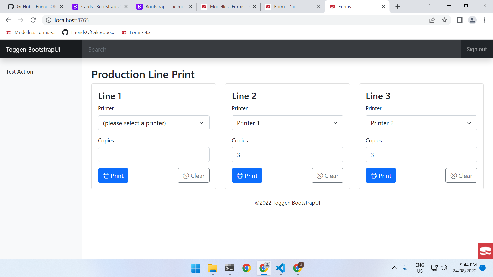

# FriendsOfCake/BootstrapUI & Multiple Modelless Forms on one Page

## Features
* Using the awesome FriendsOfCake/BootstrapUI plugin for quickly getting Bootstrap 5 running
* Adding and deleting Cookie & using them to store persistent form values
* Using `$this->Form->postLink()` inside a Form
* Using Forms classes schema and validation




## Migrations

```
bin/cake bake migration CreatePosts title:string body:text created modified
sleep 1
bin/cake bake migration CreateUsers email:string name:string created modified
sleep 1
bin/cake bake migration AddUserIdToPosts user_id:integer
```